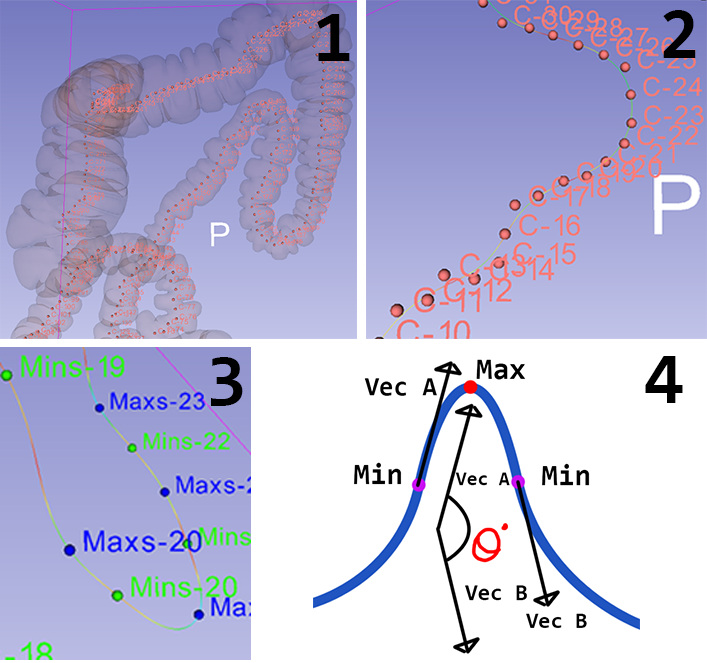

# ColonCurvature
A set of tools, and 3D Slicer extensions to analyze the curvature of colon segmentations. 

## Instructions:

#### Stage 0: Setup.
1. First, you have a project folder. 
2. Inside are several patient data folders, each titled with an 8 digit patient ID such as PTAK0070.
   Inside the patient folder, PTAK0070, is a set of files:
   A. Two files are the segmentaions of the patients colon in suppine, and prone positions. 
      These files are named as patID_ProSeg.seg.nrrd, for example PTAK0070_SupSeg.seg.nrrd.
      In each segmentation, there is a segment labeled 'colon' and one labeled 'notColon'. 
   B. Additionally, there must be an fcsv file, which contains two fiducial markups.
      The first makup is the first cut point on the mid ascending colon, and the 
      second markup is the second cut point on the middescending colon just after the splenic flexure. 
3. 3D Slicer modules required:
   - Curve Maker
   - Markups to Model
   - Extract Skeleton (default)

#### Stage 1: Generating data for each scan. 
1. Open 3D Slicer with a segmentation loaded corresponding to a patient's supine or prone CT scan, 
   and a markup fiducial node containing cut points on the mid ascending and mid descending colon. 
2. Go to the Analyze Colon module.
3. Set the input segmentation to the segmentation node mentioned in step 1.
4. Set the input cut points to the fiducial node from step 1. 
5. Set the patient path to the path that the segmentation file is stored in (the patient data folder).
6. Select whether this is a prone scan or a supine scan by entering 'Pro' or 'Sup'. 
7. Create a new output volume.
8. Press 'Apply'. There will be ~2 minutes of processing. 

#### Stage 2: Creating a patient curvature comaprison
1. Open 3D Slicer to the PatientComparison module
2. Set the patient path as the path to the patient data folder containing the results for both scans. 
3. Press 'Apply'. A file will appear in the patient data folder with the comparison. 

#### Stage 3: Creating a study with multiple patients
1. Open 3D Slicer to the CompareColonResults module
2. In file explorer, select all patient data folders and copy as path.
3. Paste the space separated list of double quotes contained paths into the field. 
4. Press 'Apply'. A summary.txt file will appear in the parent directory of the patient data paths. 

#### IMPORTANT! This process depends upon the naming scheme and organization of your files. 

## Behind the scenes

#### Stage 1
1. The segment in the segmentation called 'colon' is converted to a binary labelmap.
2. That node is passed into Extract skeleton with the paramters:
   -Input node = bin labelmap node from step 1. 
   -output image = patID_outputImg
   -skelelton type = 1D
   -Number of Points = 600
   -output points file = skeleton.txt
   -output markup fiducials = PatID_ProCenterPoints (or Sup)
3. A curve is fitted to the output points with Markups to Model:
   -Input node = the center points node
   -Output Model = PatID_ProCurve
   -Curve Type = moving least squares polynomial
   -Order = 2
   -Sampling Width = 0.05
   -Radius = 0
4. ComputeCurvatures from Curve Maker is used to output the curvature at every point 
   along the model to a text file, with x,y,z coords.
5. A new 'CurvaturesData' text file is created with additional columns for if each point
   is a max or min, and the degree change and length of the curve. 
6. CurvaturesData files are split into separate files for each segment of the colon based on your cut points. 
7. Results are generated and saved in DataResults files. 

#### Stage 2
1. The results files for supine and prone scans for a patient are compared, and the 
   key descriptive stats in each position are combined into a patient comparison file. 
   
#### Stage 3
1. The patient comparison files for the list of patients are compared, 
   key stats for each position in each segment at compiled into one
   aggregate text data file. 
2. This data file can be easily imported into Excel for further anaylsis. 
